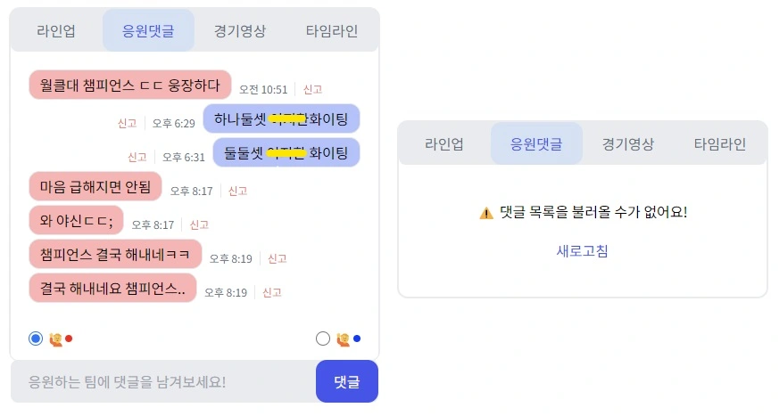
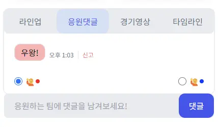
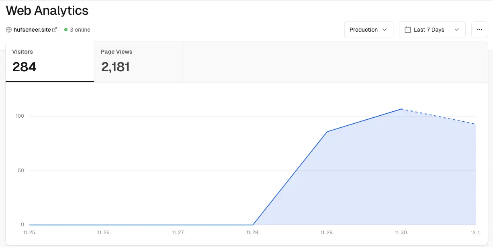

네, 맞습니다. [Hufstreaming](https://seongminn.netlify.app/etc/hufstreaming-retro/)이 **Hufschichi**가 되어 돌아왔습니다! 정말 다양한 시도를 헀고, 개인적으로 꽤나 만족하는 결과를 얻었습니다. 물론 아쉬운 점도 많지만요. 어떤 기술적인 시도를 해보았는지 되돌아볼 겸 회고를 끄적여보려 합니다.

<!-- 구구절절한 저의 스토리를 확인할 시간이 없으신 분들은 [여기]()로 이동해주세요! -->

## 새로운 팀원의 영입

<figure>
  
  <figcaption figcaption>이미지 출처: 만화 <원피스></figcaption>
</figure>

지난 1차 릴리즈를 끝낸 뒤, 부족한 인력을 여실히 체감한 우리는 새로운 팀원의 영입을 결정했습니다. 프론트엔드 팀원의 디자인 역할을 분리하기 위해 디자이너를 영입했고, 사용자 서버를 더욱 고도화할 필요가 있다고 판단하여 백엔드 팀원을 영입했습니다. 새로운 팀원들이 있었기에 더욱 만족스러운 결과물을 산출해낼 수 있었지만, 중간중간 아쉬운 지점도 있었습니다.

### 능력자 디자이너, 하지만..

언국학, 외사학에 특화된 우리 학교에는 디자인과 관련한 학과가 없습니다. 그래서 교내에서 디자이너를 구하기는 어려울 것이라 판단하여 팀원의 지인에게 디자인을 부탁했습니다. 디자이너분께서는 흔쾌히 수락하셨고, 우리는 예쁜 디자인을 기대하며 프로젝트를 다시 이어가기 시작했습니다.

그런데 예상치 못한 일이 생겼습니다. 디자이너님은 직장에 다니고 계셨는데, 매일매일 야근을 하며 회사 내 디자인 업무에 전념하느라 다른 업무에 충분한 시간을 투입하기 어려운 상황이었습니다. 결국 디자인 시안을 전달하기로 한 일정을 제대로 완수하지 못하셨고, 이는 API 개발, 컴포넌트 구성 등 개발 팀의 작업에도 영향을 미쳤습니다. 우리는 더 이상 디자인을 기다리기에는 시간이 촉박하다고 판단했고, 메인 페이지와 경기 상세 페이지를 제외한 나머지 페이지를 직접 디자인하기로 결정했습니다.

이 과정에서 개발 일정이 전체적으로 딜레이 되었고, 마지막쯤에는 또 한 번 지난 날의 고통을 맛봐야 했습니다.

<figure>
  
</figure>

후에 팀원들과 회고를 하며 되돌아 보았을 때, 개발 팀의 대처도 많이 아쉬웠다는 생각을 했습니다. 디자인이 곧 기획이 되는 것이 아니라, 기획을 바탕으로 팀원들은 각자의 작업을 진행하며 퍼즐처럼 조립하는 형태가 되어야 했습니다. 이 과정에서 API를 mocking할 수 있는 라이브러리를 사용할 수도 있었구요. 어찌 보면 당연한 것이지만, 막상 프로젝트를 진행할 때는 머릿속에 떠오르지 않아 팀원들에게 제안하지 못했다는 점에 아쉬움이 남네요.

### 정작 우리에게 필요한 건..

새롭게 모셔온 백엔드 팀원은 개발 지식이 굉장히 풍부한 분이었습니다. 덕분에 프로젝트 내에서 더욱 다양한 기술을 고려할 수 있었고, 합리적인 고민을 통해 기술을 선택하는 데에도 도움이 되었습니다.

그런데 막상 프로젝트를 진행하다 보니 초기에 기획했던 것보다 더 많은 페이지가 필요했고, 우리는 뒤늦게 깨달았습니다. 정작 필요한 것은 백엔드 개발자가 아니라 프론트엔드 개발자였다는 것을... 결국 제가 맡은 사용자 페이지는 모두 개발이 완료되었지만 관리자 페이지는 기한을 맞추지 못했고, 경기 등록, 수정 등의 작업을 포스트맨을 통한 API 요청으로 대신 해야 하는 불미스러운 사태가 벌어지기도 했습니다.😿

## 기술적인 도전!

이런 우여곡절 속에서도 기술적으로 다양한 시도를 했고, 이 과정에서 많은 것을 배울 수 있었습니다. 이 부분에 대해서는 따로 포스팅을 할 예정이니 가볍게 소개만 하고 넘어가도록 하겠습니다.

### 선언적인 에러 및 로딩 처리

React 18에 도입된 **Suspense**와 **Error Boundary**를 활용하여 선언적으로 에러 및 로딩 상태를 처리할 수 있게 되었습니다. 언젠가 꼭 사용해봐야지 하고 생각하면서 벼르고 있던 기술인데, 이번 기회에 사용하게 되었네요. 결과는 대만족✨입니다!

먼저 Suspense를 이용해서 선언적으로 Loading UI를 처리할 수 있도록 했습니다. Suspense는 원래 Lazy Loading으로 가져오는 자원을 보여줄 때 사용할 수 있는 기능이었는데, React 18으로 넘어오면서 무엇이든 기다릴 수 있는 기능이 되었다고 합니다. 이를 통해 스피너, 혹은 스켈레톤 UI을 띄워주어 사용자에게 개선된 UI를 제공하려 노력했습니다.

<figure>
    
  <figcaption figcaption>댓글 API에 에러가 발생한 경우</figcaption>
</figure>

또 Error Boundary를 통해서는 하위 컴포넌트 트리에서 발생한 에러를 잡아낼 수 있게 되었습니다. 에러가 전역으로 퍼지지 않았기 때문에 페이지 내에서 사용하는 여러 API 중 하나에 문제가 생기더라도 나머지 기능은 정상적으로 이용할 수 있습니다. 또 에러에 맞는 적절한 에러 메시지와 Fallback 컴포넌트를 사용자에게 보여 줄 수도 있었습니다. 이를 통해 새로고침 버튼 등 사용자가 대응할 수 있는 적절한 가이드를 제공할 수 있었기 때문에 UX 개선에도 큰 도움이 될 것이라 판단했습니다.

조금 아쉬웠던 건 서버에서 넘겨주는 에러 코드에 맞춰 사용자에게 보여줄 에러 메시지를 좀 더 세분화 하지 못했던 것입니다. 에러가 발생하면 이를 잡아낸 후, 별다른 로직 없이 API 호출에 실패했다는 범용적인 에러 메시지를 던져주었거든요. 이 부분에 대해서는 서버 개발자와 함께 에러 코드를 조금 더 촘촘히 구분하여 적절한 에러 메시지를 전달할 수 있게 리팩토링 하기로 했습니다. 벌써 기대가 되네요!👏

### Render Props 패턴

저는 이번 프로젝트를 진행하며, 데이터를 패칭하는 기능은 최대한 컴포넌트에서 분리하고자 노력했습니다. 컴포넌트는 UI만을 담당하고, 데이터 처리는 상위의 페이지에서 관리하는 것이 데이터 흐름을 직관적으로 파악할 수 있도록 한다고 생각했기 때문입니다. 그런데 문제가 생겼습니다. 페이지에서 데이터를 패칭하여 컴포넌트에 데이터를 전달할 때 Error Boundary를 이용했는데, 이 녀석은 앞서 설명한 것처럼 하위 컴포넌트 트리의 에러를 캐치하는 방식으로 동작합니다. 결국 제가 결정한 데이터 흐름 기준과 모순되는 지점이 발생한 것입니다. 이를 해결하기 위해 저는 Render Props 패턴을 적용한 Fetcher 컴포넌트를 생성했습니다.

```tsx
export default function PostPage() {
  return (
    <ErrorBoundary fallback={props => <ErrorFallback {...props} />}>
      <PostListFetcher>
        {({ postList }) => <PostList {...postList} />}
      </PostListFetcher>
    </ErrorBoundary>
  );
}
```

Render Props 패턴은 말 그대로 부모 컴포넌트의 render props로 자식 컴포넌트를 넘겨주는 패턴입니다. 이 때, 부모 컴포넌트의 로직을 캡슐화 한 뒤 필요한 데이터만 자식 컴포넌트에 전달할 수 있습니다. 저의 경우, 부모 컴포넌트(Fetcher)에서 에러 처리를 포함한 데이터 패치와 관련한 로직을 모두 처리하도록 하고, 데이터 패치 성공 시 전달 받은 데이터를 자식 컴포넌트에 전달하여 UI를 구성하는 책임은 자식 컴포넌트에 모두 위임할 수 있도록 하고 싶었기 때문에 해당 패턴이 유용할 것이라 판단했습니다.

그래서 Fetcher 컴포넌트의 내부를 간단히 살펴보자면 다음과 같습니다.

```tsx
type PostListFetcherProps = {
  children: ({ postList }: { postList: Post[] }) => ReactNode;
};

export default function PostListFetcher({ children }: PostListFetcherProps) {
  const { postList, error } = usePostListQuery(); // tanstack-query 사용

  if (error) throw error; // 에러 코드에 따라 커스텀 에러 반환

  return children({ postList });
}
```

이제 Fetcher 컴포넌트는 데이터를 불러오거나 에러를 처리하는 등의 로직을 담당할 수 있게 되었고, 자식 컴포넌트는 성공적으로 전달 받은 postList를 통해 화면을 그리는 일에만 집중하게 되었습니다. 결국 **page와 component의 역할을 분리하면서도 궁극적으로는 문제가 되었던 Error Boundary를 문제 없이 사용할 수 있게 되었습니다.👏**

하지만 여전히 해결해야 할 문제가 남아 있습니다. 지금은 비동기를 처리하는 hook 함수마다 하나의 Fetcher 컴포넌트를 갖고 있습니다.

```bash
🏠 queries
 |-- usePostListQuery
 |    |-- query.ts
 |    |-- Fetcher.tsx
 |-- usePostQuery
 |    |-- query.ts
 |    |-- Fetcher.tsx
 .
 .
 .
```

이 Fetcher 컴포넌트의 내부 동작은 세부적인 동작을 제외하면 대부분 비슷하기 때문에 추상화를 할 수 있을 것이라 기대하고 있습니다. 따라서 다음 리팩토링 때는 Fetcher 함수를 하나의 추상화 컴포넌트로 추출해보려 합니다.🔥

### 합성 컴포넌트로 재사용성 극대화 하기

필요한 동작을 요리조리 끼워 맞추어 원하는 기능을 구현할 수 있도록 합성 컴포넌트를 만들었고, 실제로 이를 통해 경기 상세 페이지의 Pannel 컴포넌트를 만들었습니다.

<figure>
  
  <figcaption figcaption>Pannel 컴포넌트</figcaption>
</figure>

위 화면은 제가 만든 Pannel 컴포넌트입니다. Pannel은 [toss의 한재엽님](https://www.youtube.com/watch?v=fR8tsJ2r7Eg)께서 소개하신 Dropdown 컴포넌트로 만들었는데요, 정말 좋은 자료이니 꼭 한 번씩 시청해보시는 걸 추천드립니다.👍 참고로 저는 라인업, 응원댓글, 경기영상, 타임라인을 각각 Menu 컴포넌트로 취급했습니다. 그리고 Menu를 클릭할 때마다 Pannel 내부에서 관리하는 selected 상태를 변경하고, 이를 render props 패턴을 이용하여 상위 컴포넌트로 다시 전달해주었습니다. 이제 상위 컴포넌트에서는 현재의 selected 상태에 맞는 컴포넌트를 렌더링해주기만 하면 됩니다.

컴포넌트 자체는 마음에 들었습니다. 다만 활용처가 아직은 부족하다는 게 아쉬웠습니다. Pannel 컴포넌트 이외에도 Modal, Sidebar 등 다양한 곳에서 활용될 수 있을 것으로 보입니다. 지금까지는 시간이 부족해서 건들지 않았지만, 리팩토링 기간 동안 이곳 저곳에서 야무지게 활용해보려 합니다.

이 외에도 제가 놓친 무언가가 있다면 말씀해주세요. 피드백은 언제나 환영입니다✨

## 만족스러운 결과

<figure>
  
  <figcaption figcaption>Hufschichi Vercel Analytics</figcaption>
</figure>

이번에는 사용자 행동을 트래킹할 수 있도록 `@vercel/analytics`를 도입했습니다. 그리고 이를 통해 확인한 결과는 아주 만족스러웠습니다.✨ 보시는 것처럼 3일 동안 진행된 E-Sports 대회에서 약 300명에 가까운 사용자가 서비스를 이용했고, 2천 개가 넘는 이벤트가 감지되었거든요! 지난 대회 기간 동안에는 작성된 댓글의 개수로 약 60명의 사용자가 서비스를 이용했을 것이라고 추정하기에 그쳤습니다. 하지만 이번에는 정확한 수치로 사용자 수와 행동을 로깅할 수 있었기 때문에 더욱 뿌듯한 마음이네요.

서비스에 유저가 유입될 수 있었던 가장 큰 이유는, 현실 세계에서 불편했던 문제를 효과적으로 해결했다는 점인 것 같습니다. 익숙한 일상에 휩쓸려 미처 인지하지 못했던 불편함을 객관적으로 발견하고, 이를 해결할 아이디어를 먼저 제안하여 함께 기획과 개발을 진행할 수 있도록 기회를 제공해 준 여자친구에게 큰 감사를 표현하고 싶습니다. 또한, 무턱대고 제안한 프로젝트를 흔쾌히 받아들이고 뛰어난 실력으로 함께 해 준 팀원들 덕분에 이러한 성과를 얻을 수 있었던 것 같네요. 정말 값진 경험인 것 같습니다.

## 개선할 점

자, 이제 드디어 개선할 점에 대해 이야기 해 볼 차례네요. 벌써 두 번째 릴리즈인데 왜 이렇게 개선할 점이 많은지, 참 의문입니다.

<BR />
<BR />
<BR />
<BR />
<BR />
<BR />
<BR />
<BR />
<BR />
<BR />
<BR />
<BR />
<BR />
<BR />

## KPT

### Keep

- 다양한 기술적 시도
  - React 18에 도입된 Error boundary와 Suspense를 활용하여 에러 및 로딩을 선언적으로 처리할 수 있었음
  - Render Props 패턴을 접목하여 데이터를 호출하는 컴포넌트, UI를 담당하는 컴포넌트를 분리하였음
  - 합성 컴포넌트로 재사용성이 굉장히 큰 Dropdown 컴포넌트를 만들었음
- 사용자 경험
  - 약 300명의 사용자가 접속했고, 1300개 가량의 이벤트가 감지되었음. 잘 다듬고 홍보 잘 하면 더 발전 시킬 수 있을 거 같음
  - 관리자 측에서 먼저 서비스 재사용을 요청. 관리자 입장에서도 우리 서비스가 도움이 되었다는 것

### Problem

- 관리자 경험을 제대로 하지 못했던 것
- 프로젝트의 시작과 코드 작성 시작의 차이가 너무 컸다는 것. 디자인이 미뤄지면서 화면이 어떻게 그려져야 할 지 결정되지 않았고, 결국 그 동안 리팩토링을 할 수 밖에 없었음
  - 근데 생각해보니 이 부분은, 디자인이 기획에 맞추고, 나머지 백엔드, 프론트엔드도 나온 기획을 바탕으로 먼저 코드를 작성하다가 디자인이 나오면 스타일만 입히는 식으로 하는 게 어땠을까 함.
- 코드를 짜다 보니 예외 케이스가 점점 많아졌고, 결국 마지막에는 스파게티 코드가 되었던 것
- Next.js를 괜히 사용했다는 생각
  - 애초에 Next.js를 잘 몰랐고, 그렇기 때문에 처음 프로젝트 세팅할 때 더 신중하게 고르는 것이 좋지 않았을까 하는 생각
  - 이미지 최적화, 동적 라우팅 제공 등의 다양한 기능이 있지만, 이걸 직접 해보는 것도 중요한 경험이고 크게 어렵지 않은 기능이기 때문에 충분히 할 수 있을 거라 판단
  - 우리 프로젝트에서 서버 사이드 렌더링이 크게 도움이 되었나? 🤔
  - SEO를 애초에 크게 챙길 필요도 없고, 현재까지 SEO를 위한 세팅을 하지도 않았음
- 합성 컴포넌트를 언제 생성하면 좋을지에 대한 기준이 확실하지 못했음
  - Match 컴포넌트의 경우에는 지금 보니 합성 컴포넌트로 만들 필요가 없는 듯 함.

### Try

- 리팩토링
  - 스파게티 다 치워야 함ㅠㅠ
  - Match 합성 컴포넌트 제거
  - 컴포넌트를 조금 더 작은 단위로 쪼개고 최대한 조합하여 큰 컴포넌트를 만들 수 있도록!
- 도메인 분리
  - 사용자 페이지 / 관리자 페이지 도메인 분리하는 게 좋아 보임
  - 상태도 엮이고, 코드도 혼재되어 있어서 너무 복잡함
  - 프로젝트 자체도 무거워짐
- 에러 핸들링
  - 서버와 이야기해서 에러 코드 및 상태를 더 촘촘히 나누고 사용자에게 보여줄 에러 메시지를 더 세분화할 것!
- 필요하다면 다양한 기능 추가
  - 대학 내의 다양한 대회 일정을 보여주는 캘린더 같은 것도 있으면 좋을 듯?
