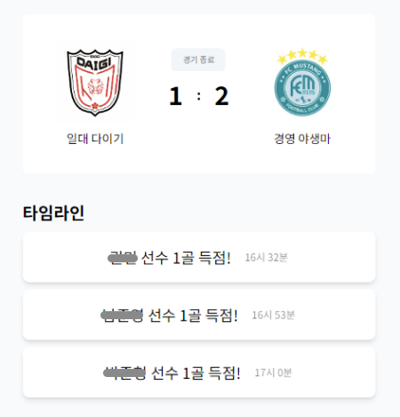
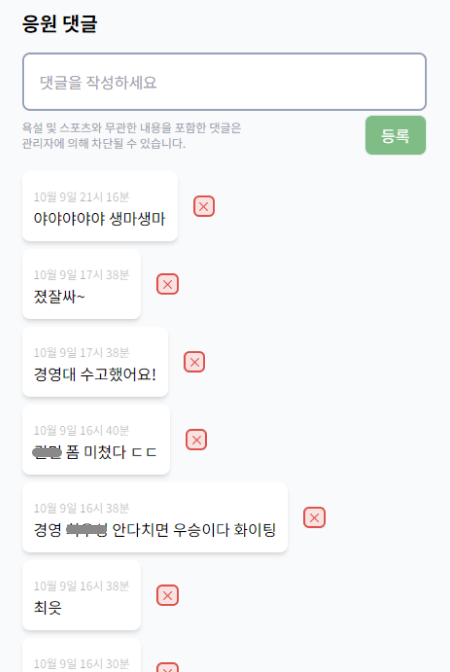
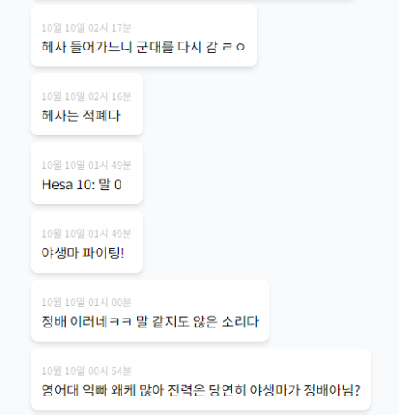
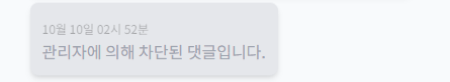
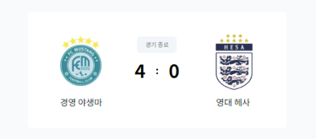

그간 수차례 프로젝트를 진행해왔습니다. 매번 프로젝트를 진행하며 했던 생각은, **실제로 사용하는 사람이 있으면 정말 좋겠다**는 것이었습니다. 근데, 그것이 실제로 일어났습니다. 많은 수는 아니지만 실제 유저를 받아 본 경험은 말로 표할 수 없을 정도로 설레는 일이었고, 지금은 그 때의 설렘을 원동력 삼아 서비스의 개선과 확장을 준비하고 있습니다. 11월에 있을 교내 e-sports 대회가 시작하기 전에, 프로젝트를 기획하고 개발해 온 과정을 간단하게 회고해보고자 합니다.

## 사이드 프로젝트, 그게 대체 뭐라고.

최근 취업 준비라는 단어와 점점 가까워지면서, 제 빈약한 프로젝트 결과물에 불안함을 느끼고 있었습니다. 그래서 어떤 서비스든 일단 만들어보자는 다짐으로 다양한 도전을 해보았지만, 함께 작업하던 사람들의 연속적인 탈퇴로 중도 무산 되는 등 대부분의 경우에 만족스럽지 못한 마무리를 해야 했습니다. 결국 계속된 실패에 프로젝트에 대한 회의를 느끼던 중, 소프트웨어 엔지니어를 꿈꾸는 여자친구와 함께 우리 스스로에게 의미 있는 서비스를 만들어볼 것을 계획했습니다. 수동적으로 프로젝트에 참여하는 것이 아니라, 내가 실제로 문제라고 생각하는 부분을 해결하기 위해 노력한다면 프로젝트에 대한 애정도 생기고 더 몰입할 수 있을 것이라 생각했습니다.

이러한 이유로 내 주변의 문제를 둘러보기 시작했고, 마침 학교 내에서 진행 중이던 축구 경기에서 해답을 찾았습니다. 전교생이 관심을 갖는 과 대항전이었고, 그만큼 많은 사람이 경기 진행 상황에 대해 관심을 갖고 있음에도 이를 실시간으로 제공할 수 있는 수단이 부재했습니다. 저희는 이거다!를 외치며 곧바로 경기를 주관하는 교내 대회 운영팀에 문의하였습니다. 내용은 다음과 같습니다.

> - 예정된 경기에 대해 경기 예정 시간을 제공
> - 진행 중인 경기에 대해 경기 진행 상황을 실시간으로 제공
> - 원하는 팀을 응원할 수 있는 댓글 기능 제공
> - 종료된 경기에 대해 최종 득점 현황 및 승패 정보를 제공

운영팀에서는 내부적으로 회의를 거친 뒤 긍정의 의사를 전달하였고, 우리는 지인들을 통해 최소한의 인력을 보충한 뒤 곧바로 개발에 돌입했습니다.

## 시작과 동시에 찾아온 위기

말 그대로 시작과 동시에 위기가 찾아왔습니다. 아니, 엄밀히 말하자면 보물 상자에 폭탄 하나를 함께 넘겨 받은 셈이죠. 운영팀의 회의가 생각보다 오래 걸렸고, 이로 인해 실제 프로젝트 시작을 결정하게 된 건 대회 시작일로부터 이틀 전이었습니다. 우리는 부랴부랴 회의를 진행했고(<s><em>사실 회의라고 하기도 민망할 정도네요..</em></s>), 프로덕트 구조에 대해 고민할 틈도 없이 우리들의 **우여곡절 좌충우돌 우당탕탕 서비스 개발기**가 시작되었습니다.

## 전화위복

최근 데브코스에서 진행한 우아한 형제들 [마광휘님](https://vallista.kr/)의 특강에서, 기한을 미뤄가며 서비스를 더 탄탄하게 완성하는 것보다 중요한 것은 바로 기한 내에 적절한 완성도의 서비스를 완성하는 것이라는 이야기를 들었습니다. 저 역시 기한을 엄수하는 것은 곧 신뢰의 영역이며, 추후 서비스를 개선을 통해 부족한 기술적 만족도를 챙길 수 있다고 생각했습니다. 결국 우리는 우리는 이틀을 내리 지새우며 결국 기한 내에 서비스를 완성하였습니다. 실제로 잠을 약 3시간씩 잤더니 일주일 내내 너무 피곤했던 기억이 나네요..

좌우지간, 대회 기획 팀에 서비스를 전달한 뒤 미뤄두었던 수면을 보충했습니다. 그러는 사이 대회가 시작되었고, 대회 운영팀은 우리 서비스를 사용하기 시작했습니다. 그러면서 우리 서비스에는 사용자가 점차 몰리고 있었고, 끊임없이 업로드 되는 댓글 목록이 이를 증명하였습니다. 이로써, 저는 처음으로 내가 개발한 서비스를 사용자가 실제로 이용하는 경험을 하게 된 것입니다. 🎉

<figure>
  
  <figcaption figcaption>경기 상세 이미지</figcaption>
</figure>

<figure>
  
  <figcaption figcaption>실제로 사용자가 작성한 댓글</figcaption>
</figure>

### 익명의 힘이란..

사용자는 상상 속의 존재가 아니었음을 발견한 우리가 감격에 빠져 있을 때였습니다. 마른 하늘에 날벼락이 친다고 했던가요. 문제는 이 때 발생하고 말았습니다. 각자가 속한 학과의 팀이 이기길 극도로 희망했던 사용자들은 결국 악성 비난 댓글을 작성하기 시작합니다.

<figure>
  
  <figcaption figcaption>어질어질한 댓글창</figcaption>
</figure>

넋 놓고 감상에 빠져 있던 우리는 이러고 있을 때가 아님을 깨닫고 재빨리 문제에 대응했습니다. 문제를 어떻게 해결할 것인지 내부적으로 논의하는 과정에서 [비속어 필터링 API](https://www.safekiso.com/)를 사용하자는 의견이 나왔지만, 가난한 학생 신분으로 월 6만원 이상의 요금을 감당하기에는 조금 부담스러웠습니다. 다 함께 열심히 돈 벌어서 당당하게 비속어 필터링 API를 사용하자고 약속하며 우리는 댓글 가리기 기능을 추가했습니다.

<figure>
  
  <figcaption figcaption>볼드모트가 되어버린 댓글</figcaption>
</figure>

`admin` 권한을 부여 받은 사용자는 직접 판단하여 댓글을 가릴 수 있습니다. 조금 번거롭지만 서비스의 크기가 아직까지는 크지 않기 때문에 충분히 감당할 수 있는 수준이라 생각했습니다. 또 추후 신고 기능을 도입하여 개선할 수 있을 것이라 기대하고 있습니다.

## 대회가 끝난 뒤

짧은 시간 안에 여러 기능을 구현해내는 데에 급급하다 보니 개선해야 할 문제가 너무나도 많습니다.

### 1. 복잡한 컴포넌트 구조와 낮은 재사용성

[카카오 엔터테인먼트 기술 블로그](https://fe-developers.kakaoent.com/2022/220731-composition-component/)를 참고하여 합성 컴포넌트로 게임 상태 정보 구현하려는 시도를 해보았습니다.

<figure>
  
  <figcaption figcaption>경시 상태 컴포넌트의 UI</figcaption>
</figure>

하지만 레이아웃이 나누어짐에 따라 컴포넌트 내부에 스타일 코드가 쌓이기 시작했고, 이는 재사용성을 급격하게 떨어뜨렸습니다. 합성 컴포넌트를 작성해 본 경험이 부족한 것도 한 몫 하는 것 같습니다.

이에 프론트엔드 팀은 컴포넌트에서 스타일을 완전히 덜어내고 어디서든 재사용할 수 있는 컴포넌트를 작성할 수 있도록 리팩토링을 감행하고자 합니다.

### 2. 사용자 에러 추적

사용자가 실제로 서비스를 이용하는 것을 확인하고 난 뒤, 우리는 사용자에게 발생한 에러를 추적하기 위해 [Sentry](https://docs.sentry.io/platforms/javascript/guides/react/)라는 서비스를 이용했습니다. 급하게 제작한 서비스이다 보니 예상치 못한 에러가 발생할 가능성이 크다고 판단하였고, 실시간으로 이에 대응하기 위한 시도였죠. 하지만 결과적으로는 크게 도움이 되지 못했습니다.

우선 짧은 시간 안에 새로운 서비스를 도입하려다 보니 이 서비스의 기능을 온전히 사용하지는 못했습니다. 기본적인 에러 추적 기능 이외에도 다양한 기능이 있었지만, 이를 당장에 사용하는 것은 무리라고 판단했습니다. 또 미흡한 에러 처리 역시 한 몫 했습니다. 에러 추적이 가능하더라도 무엇이 문제인지 정확하게 판단하기가 어려웠거든요.

이대로는 Sentry를 사용하는 의미가 없다고 판단이 되어, 추후 해당 기술에 대한 더 깊은 이해를 하고자 합니다. 또 발생할 수 있는 에러를 보다 섬세하게 핸들링하여 어떤 지점에서 어떤 에러가 발생했는지 확실하게 확인하고자 합니다. 이를 통해 사용자는 더 신뢰도 높은 서비스를 이용할 수 있을 것입니다.

### 3. Next.js 사용의 의미

함께 프로젝트를 진행하는 동료의 권유로 한 번도 사용해보지 못한 `Next.js` 환경에서 프로젝트를 진행하게 되었습니다. 여러가지 최적화 기능과 더불어 폴더 기반 라우팅의 장점이 이유였습니다.

이 외에도 `Next.js`에는 다양한 **Pre-Render** 기능을 제공합니다. 그 중 빌드 시에 미리 HTML을 생성하고, 사용자의 요청에 따라 이를 반환하는 **Static Site Generation**을 경기 상세 페이지에서 사용할 수 있을 것으로 보였습니다. 현재 경기의 정보를 요청으로 받아서 화면에 띄워 주면 관리자는 경기의 점수나 상태(전 / 후반)를 변경할 수 있습니다. 이 때 현재 경기 정보는 한 번 생성이 되면 크게 바뀔 일이 없기 때문에 SSG를 사용하여 Pre-Render 할 수 있을 것으로 보입니다. 하지만 현재 프로젝트에서는 특별한 Pre-Render 기능을 사용하지 않고 있기 때문에 이를 보완하여 사용자 경험을 향상하는 것에 대해 고려하고 있습니다.

### 4. 아쉬운 사용자 경험

대회를 끝마친 뒤 실제로 서비스를 사용한 사람들을 대상으로 설문을 진행했습니다. 그리고 이 과정을 통해 확실히 고슴도치도 제 새끼는 이쁘다는 것을 체감했습니다. 주어진 상황에서 최선을 다해 기능을 구현했기에 우리는 기술적인 부분을 제외한, 기능적인 결함은 쉽게 발견하지 못했습니다. 하지만 피드백을 받고 나서야 득점 타임라인에 해당 선수의 소속 팀 정보가 없다는 것을 알았습니다. 그래서 사용자는 누군가가 골을 넣었어도, 그게 어느 팀인지 아는 것이 어려웠습니다. 그 외에도 팀별 선수 명단을 확인할 수 없었고, 페이지 라우팅을 위한 네비게이션 바가 없었습니다.

이를 해결하기 위해 우리는 각 페이지 별 필요한 기능을 다시 한 번 정리하였고, 디자이너를 영입하여 UI/UX 개선을 도모하고 있습니다. 디자이너의 손길이 닿아 더욱 예뻐질 서비스가 정말로 기대됩니다.

## 맺음

이렇게 글로 작성하고 보니 개선할 부분이 참 많다는 생각이 드네요.😅 하지만 이와 별개로 이번 프로젝트를 진행하며 정말 값진 경험을 했습니다. 실제로 사용자를 유치하기도 했고, 실시간으로 문제 상황에 대응하기도 했습니다. 밤을 지새우며(<em><s>진짜로</s></em>) 작업해 본 경험도 빼놓을 수는 없겠죠. 짧은 시간이었지만 그 속에서 각자 최선을 다했기 때문에 이런 경험을 할 수 있었던 것이 아닐까 합니다. 덕분에 다시 한 번 개발에 대한 흥미를 환기하고 정진할 수 있는 좋은 계기가 된 것 같습니다.

현재는 서비스명이 어울리지 않는다고 판단하여 새로운 서비스명으로 출시할 것을 계획하고 있습니다. 유저들이 실제로 남겨준 소중한 피드백을 최대한 반영하여 더 예쁘고 좋은 서비스로 돌아오겠습니다. 궁금하신 분들은 한 번씩 찾아와서 구경해주세요!

[⚽ Hufstreaming 바로가기](https://hufstreaming.site/)
