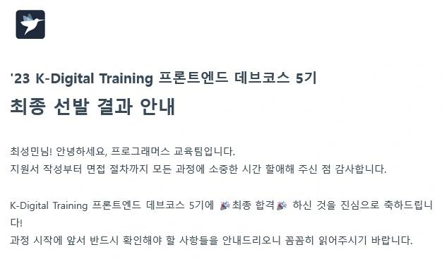

프로그래머스에서 주관하는 K-Digital Training 프론트엔드 5기 과정에 최종 합격을 하게 되었습니다. 최종 합격까지의 과정과 그 속에서 느낀 점 등에 대해 공유하고자 합니다.

## 지원 동기

데브코스에 지원하기 전의 제 상황은 슬럼프 그 자체였습니다. 졸업 프로젝트를 진행하며 배배 꼬여가는 코드와 함께 제 마음도 점점 복잡해지는 것을 느꼈습니다. 더욱이 이에 대해 조언을 구하거나 문제를 공유할 수 있는 개발 커뮤니티가 부족하다는 점에 무력감을 느끼기도 했습니다. 다양한 교육 프로그램이 이런 슬럼프를 해결하는데 도움을 줄 수 있을 것이라 판단하였고, 그 중에서 프로그래머스의 데브코스를 선택한 이유는 다음과 같습니다.

- 주최 기관의 인지도
- Vanilla JS를 바탕으로 탄탄한 기본기를 다질 수 있는 커리큘럼
- 동료 학습을 권장하는 분위기
- 탄탄한 멘토 및 강사진

## 지원서

지원서 문항은 다음과 같습니다.

- 데브코스에 지원하게 된 동기는 무엇인가요?
- 데브코스와 별개로 원래는 어떤 계획을 갖고 있었나요?
- 개발자가 되고 싶은 이유는 무엇인가요?
- 웹 프론트엔드 분야를 선택한 이유는 무엇인가요?
- 웹 프론트엔드 진로를 위해 그동안 어떤 노력을 하셨나요?
- 강도 높은 과정입니다. 데브코스에서 어떻게 학습을 이어갈 계획인가요?

 

이 외에도 선택 문항이 몇 가지 있었는데, 저는 모든 문항에 대한 답변을 작성하여 제출했습니다. 지원서에서는 제가 데브코스에 대해 얼마나 큰 관심을 갖고 있는지 보여주는 것에 집중했습니다. 저는 데브코스 커리큘럼 중 동료들과 함께 학습할 수 있는 **코어 타임**에 가장 큰 매력을 느꼈습니다. 그렇기 때문에 왜 코어 타임이 매력적인지, 그리고 코어타임을 어떻게 이용할 것인지에 대해 보여주고자 노력했습니다.

더불어 성장하고자 하는 열정이 얼마나 뛰어난 지를 통해서 어필하기도 했습니다. 교육 프로그램을 제공하는 기업의 목표는 훌륭한 수강생들을 양성하여 기업의 인지도를 높이는 것이라 생각합니다. 따라서 성장에 대한 열정이 얼마나 뛰어난 지 보여주는 것이 큰 도움이 될 것이라 생각했습니다.

## 실력 확인 테스트

서류 지원에 통과하고 실력 확인 테스트에 응시하였습니다. 기본적인 주의사항만 잘 지킨다면 서류 지원에서 탈락하는 경우는 없는 줄 알았는데, 꼭 그렇지는 않은가 봅니다.

실력 확인 테스트는 총 33문항으로, HTML/CSS, JS를 포함한 WEB 관련 객관식 30문항과 알고리즘 테스트 3문항으로 구성되어 있었습니다. 객관식 문제는 크게 어려운 부분 없이 해결할 수 있었고 _~(아마...?)~_, 알고리즘 테스트에서는 아쉬운 부분이 많았습니다. 한 문제는 모든 테스트 케이스를 통과할 수 있었습니다. 하지만 학업을 핑계로 알고리즘 공부를 미뤄 두었던 탓에 다른 한 문제는 약 70% 정도의 테스트 케이스만 통과하였고, 마지막 문제는 모든 테스트 케이스에 대해 실패했습니다. 조금의 현타를 느끼고😥 현재는 1일 1알고리즘을 목표로 학습하고 있습니다. 데브코스 과정을 진행하는 동안에도 빼먹지 않고 진행할 예정입니다.

## 면접

코딩 테스트에 합격하여, 면접을 볼 수 있는 기회가 주어졌습니다. 저는 쉽게 긴장하는 성격 탓에 항상 면접에서 만족스럽지 못한 결과를 얻었습니다. 이번에도 마찬가지로 덜컥 겁이 났지만, 이를 극복하기 위해 더 꼼꼼하게 준비했습니다.

면접은 한 분의 면접관과 4명의 지원자로 이루어진 일대다 형식이었습니다. 공통 질문 3개와 개인 질문 3-4개를 차례로 답변하였고, 아이스 브레이킹 시간은 없이 바로 진행되었던 것 같습니다. 공통 질문은 지원서에 작성한 내용이 사실인지 확인하는 듯 했고, 개인 질문을 통해서는 사용해 본 기술에 대해 얼마나 잘 알고 있는지 확인하는 듯 했습니다. 하지만 모두 지원서에 기술한 내용에 대해 다루고 있으니, 지원서를 꼼꼼히 숙지하고 준비하면 좋을 것 같습니다.

## 최종 합격

말씀드렸던 것처럼 면접에는 자신이 없었기 때문에 마음을 졸이며 최종 발표일을 기다렸습니다.

<figure>
  
</figure>

그리고 최종 합격을 했습니다아 🎉

## 소감

사실 최근 슬럼프도 겪고 있었고, 탈락의 고배를 지나치게 많이 맛보는 바람에 걱정스러운 마음이 컸습니다. 어렵게 따낸 기회이니 만큼 수료하기까지 열정적으로 임하여 목표했던 것들을 모두 이뤄내고자 합니다. 중요한 것은 데브코스를 진행하며 자연스레 성장할 것이라는 안일한 생각을 버리는 것입니다. 데브코스의 가장 큰 메리트는 좋은 환경에 좋은 동료들과 함께 있다는 것이라 생각합니다. 때문에 이를 적극 활용하여 스스로 성장할 수 있는 힘을 기르는 시간으로 만들고자 합니다. 그렇게 했을 때 데브코스는 비로소 더 좋은 개발자가 되기 위한 좋은 터닝 포인트가 될 것입니다.

다음에는 데브코스를 진행하며 배운 내용들, 회고를 주제로 찾아오도록 하겠습니다☺️
