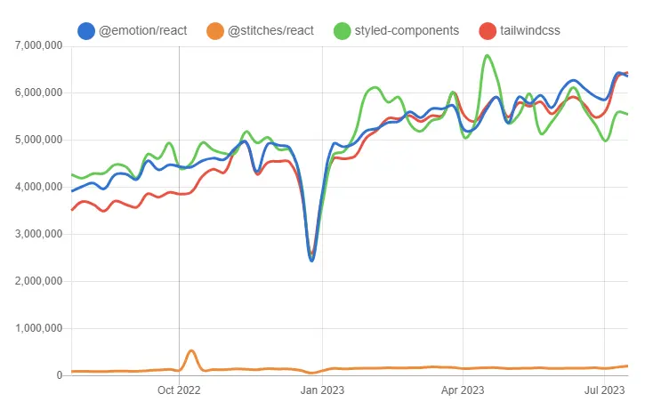
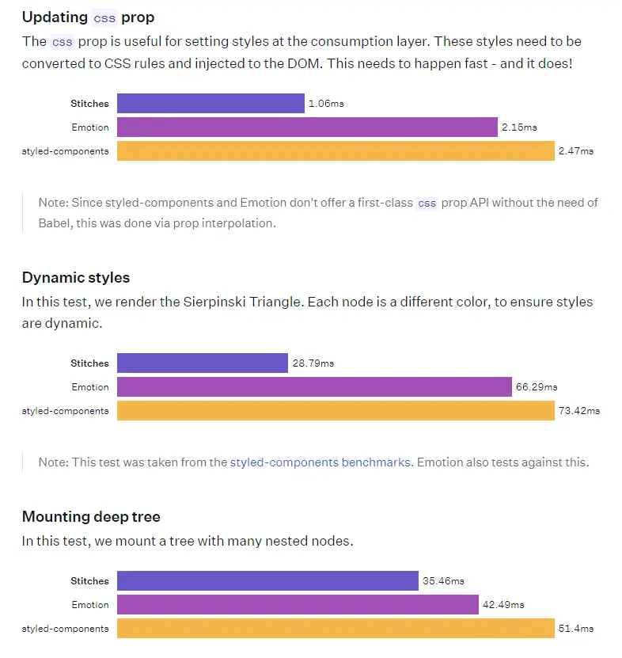

새롭게 시작한 프로젝트에서 Stitches를 이용하여 컴포넌트 스타일링 작업을 하게 되었습니다. Stitches를 사용하기로 최종 결정한 이유와, 이를 실제 프로젝트에 적용하는 방법에 대해 가볍게 알아보고자 합니다.

# TL;DR

> 1. Stitches는 가볍고 성능이 우수한 CSS-in-JS 라이브러리로, **Near-Zero Runtime**을 특징으로 합니다.
> 2. SSR(서버 사이드 렌더링)의 필요성이 높아지면서, Stitches는 **모든 브라우저에 호환되는 SSR을 지원**합니다.
> 3. 다른 CSS-in-JS 라이브러리와 유사한 사용법으로, 사용하기 쉽고 **낮은 러닝 커브**를 가지고 있습니다.

# Stitches

프론트엔드 생태계에는 다양한 CSS 라이브러리가 존재합니다. 아래는 몇가지 주요한 CSS 라이브러리와 Stitches의 최근 사용 트렌드를 시각화하여 나타낸 모습입니다.

<figure>
  
  <figcaption figcaption>출처: <a href="https://npmtrends.com">https://npmtrends.com</a></figcaption>
</figure>

다른 라이브러리들에 비해 Stitches는 사용률이 현저히 떨어지는 모습을 확인할 수 있습니다. 그렇다면 왜 굳이 자료도 별로 없고, 사용률도 저조한 Stitches를 골랐을까요? 아래에서 차근차근 살펴보도록 합시다.

## 1. Near-Zero Runtime

Stitches는 가볍고 빠른 성능을 자랑하는 CSS-in-JS 라이브러리 중 하나입니다. CSS-in-JS는 런타임 시 동적으로 CSS를 생성하여 적용하기 때문에 자바스크립트 코드와 CSS가 상태값을 쉽게 공유할 수 있다는 장점이 있습니다. 하지만 이러한 접근 방식은 런타임 시 자바스크립트 코드를 CSS로 변환하는 시간이 필요하다는 단점이 있기 때문에, 일반적인 CSS 스타일링에 비해 성능이 떨어질 수 있습니다.

Stitches는 이러한 문제를 해결하기 위해 불필요한 속성 보간(Prop Interpolations)을 줄이는 방식을 채택합니다. 속성 보간이란, 쉽게 말해 **Component Prop에 의한 동적 스타일링**을 제공하는 것을 말합니다. 예를 들어, styled-components에서는 prop에 의한 동적 스타일링이 가능한데, 이는 미리 정의할 수 없는 값이기 때문에 사전에 최적화하기가 어렵습니다. 하지만 Stitches는 사전에 정의한 variants를 통해서만 스타일링 하도록 하여 런타임 오버헤드 문제를 어느정도 해결할 수 있습니다.

아래는 Stitches에서 제공하는 타 CSS-in-JS 라이브러리들과의 성능 비교입니다.

<figure>
  
  <figcaption>출처: <a href="https://stitches.dev/docs/benchmarks">https://stitches.dev/docs/benchmarks</a></figcation>
</figure>

Stitches의 성능이 타 라이브러리들에 비해 빠른 것을 확인할 수 있습니다.

## 2. Server-Side Rendering 지원

최근 SPA(Single Page Application)에서 발생하는 초기 로딩 속도 문제와 SEO 문제를 해결하기 위해 SSR(Server-Side Rendering)의 필요성이 점점 확대되고 있습니다. Stitches는 이러한 흐름에 발맞춰 모든 브라우저에 호환되는 SSR을 지원합니다.

이러한 이유로 Stitches를 사용하기로 결정했습니다.

> **🚨 주의할 점**
>
> https://github.com/stitchesjs/stitches/discussions/1149 <br />
> 현재 Stitches의 팀원들이 프로젝트에 참여할 수 없어 유지보수 하기가 힘든 상황이라고 합니다. 유지보수에 참여할 개발자를 찾고 있지만, 22년 4월 이후로 업데이트가 되지 않기도 했고 지원자가 모일지도 불분명해 보입니다. 하지만 현 시점에 큰 문제가 있는 것은 아니며, 짧은 기간 동안 공부를 목적으로 한 프로젝트이기에 Stitches를 사용해도 괜찮다고 판단했습니다.
>
> Stitches의 도입을 고민하는 분들에게 이 글이 참고가 되었으면 합니다.

# Stitches 적용하기

## 1. 설치

```bash
# With npm
npm install @stitches/react

# With yarn
yarn add @stitches/react
```

## 2. 사용

다른 CSS-in-JS 라이브러리처럼 `styled`, `css` 함수 등을 불러와 사용할 수 있습니다.

```js
import { styled } from '@stitches/react';

const Button = styled('button', {
  backgroundColor: 'gainsboro',
  borderRadius: '9999px',
  fontSize: '13px',
  border: '0',

  '&:hover': {
    backgroundColor: 'lightgray',
  },
});
```

이 때 주의할 점은, Stitches는 번들 크기를 최소화하기 위해 문자열 구문 대신, 자바스크립트 객체 표기법을 사용합니다.

## 3. Variants

앞서 살펴본 것처럼 Stitches는 런타임 오버헤드를 줄이기 위해 사전에 Variants를 정의하고 사용합니다. defaultVariants를 통해 기본값을 설정할 수도 있습니다.

```js
const Button = styled('button', {
  // base styles

  variants: {
    color: {
      violet: {
        backgroundColor: 'blueviolet',
        color: 'white',
        '&:hover': {
          backgroundColor: 'darkviolet',
        },
      },
      gray: {
        backgroundColor: 'gainsboro',
        '&:hover': {
          backgroundColor: 'lightgray',
        },
      },
    },
  },

  defaultVariants: {
    color: 'violet',
  },
});

const App = () => {
  return (
    <>
      <Button color="violet">버튼</Button>
    </>
  );
};
```

## 4. Configuration 객체 생성

Configuration 객체를 생성하여 공통 스타일을 정의할 수 있습니다. `stitches.config.ts` 파일에서 `createStitches` 함수를 불러와 생성할 수 있고, 해당 함수는 여러가지 config 객체를 반환합니다.

```ts
// stitches.config.ts

import { createStitches } from '@stitches/react';

export const {
  styled,
  css,
  globalCss,
  keyframes,
  getCssText,
  theme,
  createTheme,
  config,
} = createStitches({
  // 디자인 테마를 정의합니다.
  theme: {
    colors: {
      gray400: 'gainsboro',
      gray500: 'lightgray',
    },
  },
  // 반응형 분기를 정의합니다.
  media: {
    bp1: '(min-width: 480px)',
  },
  // DX를 향상시킬 수 있는 커스텀 유틸리티 함수를 정의합니다.
  utils: {
    marginX: value => ({ marginLeft: value, marginRight: value }),
  },
  // CSS 속성의 카테고리를 정의합니다.
  themeMap: {
    width: 'space',
    height: 'space',
  },
});
```

`createStitches` 함수로 생성한 객체를 사용하면 공통으로 정의한 theme, media, utils 등을 사용할 수 있습니다. 이 때, 해당 변수는 달러 사인($)을 prefix로 갖는 문자열 형태로 사용할 수 있습니다.

```ts
export const { styled } = createStitches({
  theme: {
    colors: {
      gray400: 'gainsboro',
    },
  },
});

import { styled } from 'path/stitches.config';

const MyComponent = styled('div', {
  color: '$gray400', // color: 'gainsboro'
});
```

## 5. Global Style 설정

globalCss 함수로 전역 스타일을 지정할 수 있습니다. 해당 함수는 레이아웃을 담당하는 \_app.tsx 파일에서 불러와 호출할 수 있습니다.

```ts
import { globalCss } from 'stitches.config';

export const globalStyles = globalCss({
  '*': {},

  'html, body': {},
});

// _app.tsx

import { globalStyles } from '@/styles/globalStyles';
import type { AppProps } from 'next/app';

export default function App({ Component, pageProps }: AppProps) {
  globalStyles();

  return <Component {...pageProps} />;
}
```

## 6. SSR 설정

`createStitches` 함수를 통해 생성된 getCssText 함수로 SSR 설정을 할 수 있습니다.

다음은 Next.js 환경에서의 SSR 설정 예시입니다.

```ts
// stitches.config.ts

export const { getCssText } = createStitches();

// _document.ts

import { Html, Head, Main, NextScript } from 'next/document';
import { getCssText } from '@/styles/stitches.config';

export default function Document() {
  return (
    <Html lang="en">
      <Head>
        <style
          id="stitches"
          dangerouslySetInnerHTML={{ __html: getCssText() }}
        />
      </Head>
      <body>
        <Main />
        <NextScript />
      </body>
    </Html>
  );
}
```

# 맺음

세상에는 CSS 라이브러리 뿐만 아니라, 다양한 역할의 라이브러리가 존재합니다. 그 중 본인의 상황에 가장 적절한 것이 무엇인지 판단하고 채택하는 과정이 중요합니다. 저 역시 이번 프로젝트에서 Stitches와 타 CSS 라이브러리를 부족하게나마 비교하면서 자신만의 기준을 적용해보았고, 이를 공부하며 프로젝트에 적용하기까지의 과정이 앞으로 개발을 하는데에 있어 큰 양분이 될 것이라 느낍니다.

#### 참고

- [Stitches 공식 문서](https://stitches.dev/)
